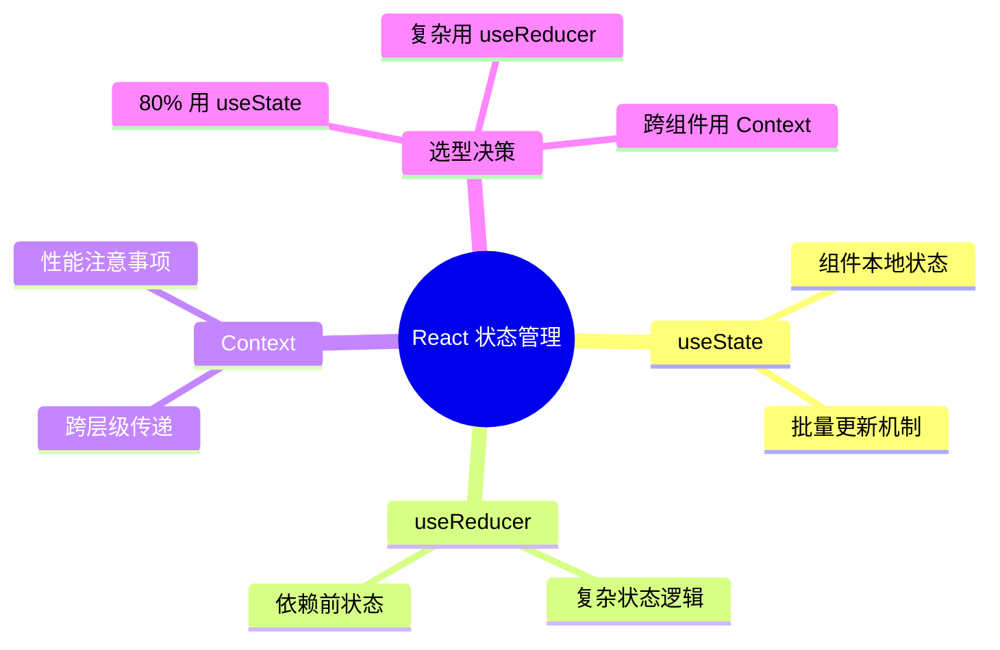

# Video to Notes — 视频转学习笔记

**看视频 ≠ 学会。笔记才是真正属于你的知识。**

用户只需要说一句："帮我把这个视频整理成笔记"。剩下的事 AI 自己搞定。

---

## 用户视角 —— 他们只需要知道这些

用户不需要理解 Python、ffmpeg、whisper 是什么。他们只需要：

1. **提供视频** — 给文件路径，或者发个链接（YouTube/B站等）
2. **说明需求**（可选）— "用英文"、"只要重点"、"按课堂笔记风格"
3. **等着拿笔记**

AI 自动完成全部工作。

---

## AI 工作流

### 第一步：检测 & 安装依赖

用户说想转视频后，**AI 先静默检查环境**：

```bash
# 检查所有依赖，缺什么装什么
python3 --version               # 缺 → brew install python3
ffmpeg -version                  # 缺 → brew install ffmpeg
python3 -c "import whisper"      # 缺 → pip3 install openai-whisper
pip3 list 2>/dev/null | grep -q yt-dlp  # 缺 → pip3 install yt-dlp （可选，仅URL需要）
```

> ⚡ **依赖安装规则（必遵守）**
>
> 所有环境安装操作必须遵循以下步骤：
>
> 1. **先检测，再报告** — 运行检测后，明确告诉用户哪些工具/包缺失，用具体名称列出
> 2. **必须征得用户明确同意** — 拿到 `yes` / `可以` / `装` 后再执行；不要直接后台静默安装
> 3. **安装命令必须完整告知** — 例如 `pip3 install openai-whisper` 或 `brew install python3 ffmpeg`
> 4. **没有例外** — 即使是 pip 包也需用户确认后再装

### 第二步：获取视频

| 来源 | AI 处理方式 |
|------|------------|
| **本地文件** | 直接读取路径 |
| **URL（YouTube/B站等）** | 先告知用户要下载到哪个目录，确认后再执行 `python3 scripts/download_video.py <URL> --output-dir <目录>` |
| **平台限制无法下载** | 礼貌告知用户："这个平台的视频有限制，能不能先下载到本地发给我？" |

### 第三步：转写

```bash
python3 scripts/transcribe.py <视频路径> [选项]
```

**参数选择逻辑：**

| 场景 | 推荐参数 |
|------|---------|
| 普通视频 | `--model base`（默认，速度与精度平衡） |
| 长视频（>1h） | `--model turbo` + `--speed 1.3`（快 ~50%） |
| 中文视频 | 加 `--language zh` 提升准确率 |
| 批量处理 | 多个路径一起传，最多 3 个 |
| 超长视频（>2h） | 自动提示用户，建议只处理单个文件确保质量 |
| 追求极致速度 | `--model turbo --strip-silence --speed 1.5`（快 ~70%） |
| 精度优先 | `--model large` + `--no-strip-silence`（保留所有细节） |

### 第四步：AI 生成学习笔记 ⭐ — 核心价值

转写完成后，读取 `.txt` 文件，按以下流程生成笔记：

---

#### 4a. 智能分段（Semantic Chunking）

转写稿是逐句时间戳文本，AI 先做一次**语义分章**，给笔记搭骨架：

1. 扫描全文，根据话题切换、关键词、语气变化识别**逻辑段落**
2. 为每个段落生成**章节标题**（概括该段核心内容）
3. 输出分段大纲作为笔记的目录骨架

```markdown
示例输出：

## 分段大纲

| # | 章节 | 时间范围 | 核心内容 |
|---|------|---------|---------|
| 1 | 什么是状态管理 | 00:00-08:30 | 定义、为什么需要 |
| 2 | useState 原理 | 08:30-20:15 | 工作机制、批量更新 |
| 3 | useReducer 对比 | 20:15-35:00 | 适用场景、代码示例 |
| 4 | Context 跨组件通信 | 35:00-45:00 | 使用模式、性能注意 |
```

> 分段粒度：一般 5-15 分钟一段。短于 3 分钟的和相邻段落合并。

---

#### 4b. 生成逻辑结构图（长内容）

转录稿超过 **5000 字** 或视频 **>30 分钟**时，在笔记正文之前先生成一张**Mermaid 逻辑图**，作为内容的**知识地图**，帮助读者在深入前建立全局认知。

**选择逻辑图类型：**

| 内容结构 | 推荐图类型 | 示例 |
|---------|-----------|------|
| 层级/分类知识 | `mindmap` | 技术概念分类、知识体系 |
| 流程/步骤 | `flowchart TD` | 操作流程、算法步骤、决策树 |
| 时序/阶段 | `timeline` | 历史发展、项目阶段 |
| 对比/分类 | `flowchart LR` | 方案选型、特征对比 |
| 关系/网络 | `graph` | 概念关联、系统架构 |



> **图在笔记最前面**，后面的详细内容按图展开。读者可以先看图再决定精读哪部分。

---

#### 4c. 重点标记系统

笔记中引入三级标记，让重要内容一目了然：

| 标记 | 含义 | 用于 |
|------|------|------|
| ⭐ **核心必记** | 定义、公式、关键结论 | 每个知识模块的 1-2 个最要点 |
| 🔧 **实操要点** | 代码、命令、操作步骤 | 有实操价值的内容 |
| ⚠️ **易错/注意** | 坑、边界情况、常见误解 | 容易犯错的地方 |

**智能标记规则：**
- 每个知识点模块下，用 `💡 核心提炼` 子节把该模块最重要的 1-3 个点浓缩成一句话
- 标记不要滥用：正文中自然使用，不是每条都标
- 复习时只看 ⭐ 标记的内容就能回忆 80% 关键信息

```markdown
### 1. useState — 基础状态管理

**原理说明：**
- ⭐ 每次 setState 触发重新渲染，React 通过 Fiber 协调更新
- 批量更新合并同一事件循环中的多次 setState

**注意事项：**
- ⚠️ 状态更新是异步的，不能在 setState 后立即读取新值
- 解决方案：使用 useEffect 监听状态变化

> 💡 **核心提炼：** useState 适合 80% 的组件内简单状态，更新是异步且批量的。
```

---

#### 4d. 生成速查卡（Quick Reference Card）

笔记末尾追加一张**速查卡**，把核心概念浓缩成一览表，适合复习时快速翻阅：

```markdown
## 🃏 速查卡

| 概念 | 一句话 | 标记 |
|------|--------|:----:|
| useState | 组件本地简单状态，更新异步批量 | ⭐ |
| useReducer | 复杂状态逻辑，依赖前状态时用 | ⭐ |
| Context | 跨层级传递，不是状态管理方案 | ⚠️ |
| 批量更新 | 同一事件循环中合并多次 setState | 🔧 |
```

> 速查卡是笔记的**精华浓缩**，一页看完所有重点。

---

#### 4e. 组装完整笔记

将上述结果按顺序组装：

```
1. [4b] 逻辑结构图（仅长内容）
2. [4a] 分段大纲
3. 完整笔记正文（匹配风格模板，含 ⭐🔧⚠️ 重点标记）
4. [4d] 速查卡
```

**笔记风格自动匹配（同之前）：**

| 内容类型 → | 自动选择风格 |
|------------|-------------|
| 编程/技术教程 | 📚 **标准学习笔记** — 带代码块、架构说明 |
| 学生网课/公开课 | 🎓 **课堂笔记** — 考点、例题、易错点 |
| TED/演讲/行业分享 | 🏢 **演讲笔记** — 核心观点、金句、行动项 |
| 纪录片/科普 | 📰 **纪录片笔记** — 时间线、发现、数据 |
| 一般教学/培训 | 📚 **标准学习笔记** — 知识要点结构化 |

> 详细模板见 → [📖 笔记模板参考](references/note-templates.md)

**笔记语言：** 默认用当前对话语言。用户可指定（"用英文写"、"中日双语"等）。

**质量准则：**
- 详细准确 / 结构化清晰 / 信息密度高
- 忠实原文不编造 / 设计为可复习
- ⭐🔧⚠️ 标记要自然融入，不是每条都标
- 速查卡必须是最核心的 5-10 条，不含冗余

---

## 脚本参考（AI 用）

### `scripts/transcribe.py`

```bash
# 日常
python3 scripts/transcribe.py course.mp4

# 长视频 + 中文
python3 scripts/transcribe.py lecture.mp4 --model turbo --language zh

# 长视频加速（静音裁剪 + 1.3x 变速）
python3 scripts/transcribe.py lecture.mp4 --strip-silence --speed 1.3

# 极限速度
python3 scripts/transcribe.py long.mp4 --model turbo --strip-silence --speed 1.5

# 批量
python3 scripts/transcribe.py p1.mp4 p2.mp4 p3.mp4
```

### `scripts/download_video.py`

```bash
python3 scripts/download_video.py "https://youtube.com/watch?v=xxx" --output-dir 目录
```

---

## 常见用户需求 & AI 应对

| 用户说 | AI 怎么做 |
|--------|----------|
| "帮我把这个视频整理成笔记" | 检测依赖 → 转写 → 自动匹配风格生成笔记 |
| "把桌面上这三个视频都处理了" | 批量转写，最多3个；如果是系列课程，跨文件整合成连贯知识体系 |
| "用英文写笔记" | 转写保持原语言，笔记用英文生成 |
| "这个 TED 演讲帮我记一下" | 识别为演讲类型 → 用演讲笔记模板 |
| "只要第二个部分的内容" | 选择性转写/笔记，跳过无关内容 |
| "太长了，先处理这一个" | 长视频自动建议只处理单个 |
| "这是 YouTube 链接" | 下载 → 转写 → 笔记 |

---

## 注意事项

- **隐私：** 转写稿和笔记可能包含敏感内容，完成后提醒用户检查并酌情删除
- **版权：** 下载网络视频请遵守平台条款，仅用于个人学习
- **文件清理：** 临时 `.wav` 自动删除，只留 `.txt` 和笔记
- **输出路径：** 默认以视频文件所在目录或用户指定目录作为输出位置，生成前告知用户
- **长视频：** >2h 自动提示，建议单文件处理
- **失败处理：** 下载失败/转写出错 → 友好告知用户并提供替代建议

---

## 资源结构

```
video-to-notes/
├── SKILL.md                      ← 本文
├── scripts/
│   ├── transcribe.py             ← 语音转文字
│   └── download_video.py         ← 网络视频下载
└── references/
    ├── workflow.md               ← 详细工作流（AI 参考）
    └── note-templates.md         ← 笔记模板 & 示例
```
