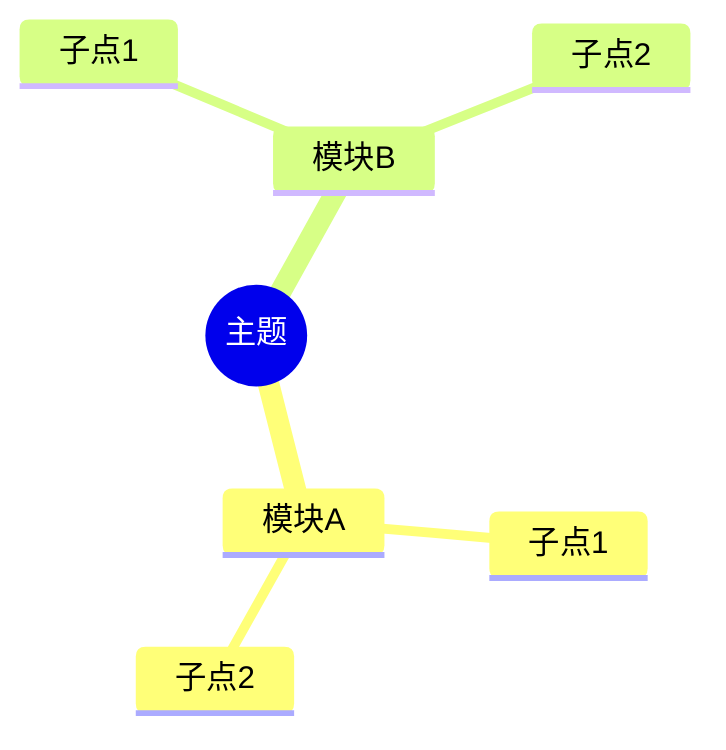

# 笔记模板 & 示例

本文件提供不同场景下的笔记模板和完整示例，供 AI 在生成笔记时参考。

AI 应**根据视频内容类型自动选择**合适的模板，也可按用户要求切换。

---

## 📚 模板一：标准学习笔记（最常用）

适合：技术教程、在线课程、讲座、深度内容

```markdown
# [视频标题]

## 📋 视频信息
- **时长：** XX分钟
- **主题：** 一句话概括
- **来源：** 视频链接/路径

## 📖 内容概览

用 2-3 句话概括视频核心内容。

## 🧠 知识要点

### 1. [核心概念/模块一]

**关键定义：**
- XXX：详细解释

**原理说明：**
- 机制/流程/逻辑

**示例/类比：**
- 帮助理解的例子

### 2. [核心概念/模块二]

...

### 3. [核心概念/模块三]

...

## 💻 实战 / 代码（如有）

\`\`\`语言
代码块
\`\`\`

**关键代码解读：**
- 第X行：作用说明

## 📊 总结对比（如有）

| 对比项 | A | B |
|--------|---|---|
| 特点 | | |
| 适用 | | |
| 优劣 | | |

## 🎯 总结

- 核心收获点 1
- 核心收获点 2

## 🔗 延伸思考

- 值得进一步探索的方向
- 与其他知识的关联
- 实际应用建议
```

### 标准学习笔记 — 完整示例（虚构）

```markdown
# React 状态管理深度解析

## 📋 视频信息
- **时长：** 45分钟
- **主题：** React 中 useState、useReducer 和 Context 的工作原理及选型
- **来源：** 内部课程

## 📖 内容概览

视频深入讲解了 React 三种状态管理方案的底层机制，并通过对比分析给出了不同场景下的选型建议。核心观点是：没有银弹，选择取决于状态复杂度、更新频率和作用域。

## 🧠 知识要点

### 1. useState — 基础状态管理

**工作原理：**
- 每次 setState 触发组件重新渲染
- React 通过 Fiber 架构的"双向循环"协调更新
- 批量更新（batching）合并同一事件循环中的多次 setState

**关键特性：**
- 适合：组件内部简单状态
- 注意：状态更新是异步的，不能在 setState 后立即读取新值

### 2. useReducer — 复杂状态逻辑

**适用场景：**
- 状态逻辑复杂，包含多个子值
- 下一个状态依赖于前一个状态
- 状态变更需要集中管理

**模式对比：**
```javascript
// useState 方式
const [count, setCount] = useState(0)
setCount(c => c + 1)

// useReducer 方式
const [state, dispatch] = useReducer(reducer, initialState)
dispatch({ type: 'INCREMENT' })
```

### 3. Context + useReducer — 跨组件状态

**架构模式：**
- Context 负责"传递"（跨层级）
- useReducer 负责"管理"（逻辑集中）
- 组合使用可实现轻量级全局状态管理

**性能注意事项：**
- Context value 变化会触发所有消费者重渲染
- 解决方案：拆分 Context、使用 memo

## 🎯 选型决策树

```
简单组件内状态 → useState
状态逻辑复杂 → useReducer
跨组件共享 → Context + useReducer
大规模全局 → Redux/Zustand 等外部库
```

## 💡 总结

1. useState 是基础，80% 场景够用
2. useReducer 在状态逻辑复杂时替代 useState
3. Context 是"传递"机制，不是状态管理方案
4. 组合使用前两者 + Context 可覆盖绝大多数场景

## 🔗 延伸思考

- React 19 的 use() Hook 会如何影响状态管理模式？
- Signal（SolidJS 的方案）对比 React 的状态管理有什么不同？
```

---

## 🎓 模板二：课堂笔记风格

适合：学生网课、公开课、考试培训

```markdown
# [课程名称] — 第X讲

## 📋 课程信息
- **课程：** XXX
- **讲师：** XXX
- **时长：** XX分钟

## 📌 本讲要点

1. 要点一
2. 要点二
3. 要点三

## 📝 知识点详解

### [知识点1]
- 定义/公式
- 理解要点
- 例题

### [知识点2]
...

## ⚠️ 易错点 / 难点

- 常见错误理解
- 容易混淆的概念

## 📖 例题解析

**题目：** ...
**解题思路：** ...
**答案：** ...

## 📑 课后思考

- 课后习题
- 延伸阅读

## 📋 复习速查

- [ ] 知识点1 理解了吗？
- [ ] 知识点2 公式记住了吗？
- [ ] 例题能独立做一遍吗？
```

---

## 🏢 模板三：会议 / 演讲笔记

适合：TED 演讲、行业分享、内部会议

```markdown
# [演讲/会议标题]

## 📋 基本信息
- **主讲人：** XXX
- **背景：** 演讲/会议的背景信息
- **时长：** XX分钟

## 🎯 核心观点

一句话概括演讲者的核心论点。

## 🔑 关键要点

### 1. [要点一]
- 详细说明
- 支持数据/案例

### 2. [要点二]
...

## 📊 重要数据

- 数据点1
- 数据点2

## 💬 金句摘录

> "引用原文金句"

## ✅ 启发 & 行动项

- 可以做的 1-2-3
- 值得深入思考的点

## 🤔 批判性思考

- 论点的局限性
- 不同视角的补充
```

---

## 📰 模板四：纪录片 / 科普笔记

适合：纪录片、科普视频、深度分析、历史人文

```markdown
# [纪录片/科普标题]

## 📋 背景介绍
- 主题简介
- 发布方/作者
- 观看时间

## ⏳ 时间线 / 发展脉络

| 时间/阶段 | 事件/发现 | 意义 |
|-----------|-----------|------|
| ... | ... | ... |

## 🔬 核心发现

### 发现一：...
- 证据/数据支持
- 专家观点

### 发现二：...
...

## 📊 关键数据 & 事实

- 事实1
- 统计数字

## 🤔 个人思考

- 对内容的思考
- 与其他知识点的关联
- 启发 & 疑惑

## 📚 延伸资源

- 片中提到的书籍/文章
- 相关话题推荐
```

---

## 🛠️ 模板选择逻辑

AI 应按以下优先级选择笔记风格：

1. **用户明确指定** → 按用户要求
2. **内容类型自动识别**：
   - 编程/技术内容 → 标准学习笔记（带代码块）
   - 学术/考试内容 → 课堂笔记
   - TED/演讲/分享 → 演讲笔记
   - 纪录片/历史/科普 → 纪录片笔记
   - 一般性教学/培训 → 标准学习笔记
3. **混合内容** → 灵活组合多种风格元素

## ⚙️ AI 自由度

以上模板是参考框架，不是死规定。AI 应根据实际情况：
- **增删章节** — 不需要的去掉，需要的加上
- **调整顺序** — 以逻辑流畅为准
- **改变深度** — 简短视频给精简版，长视频给详细版
- **整合系列** — 批量处理时，可跨视频整合成连贯知识体系

---

## 🏷️ 通用：重点标记约定

所有笔记模板中，正文内容使用三级标记突出重点：

| 标记 | 含义 | 示例 |
|------|------|------|
| ⭐ **核心必记** | 定义、公式、关键结论 | `- ⭐ useState 每次 setState 触发重新渲染` |
| 🔧 **实操要点** | 代码、命令、操作步骤 | `- 🔧 打包命令: pnpm build` |
| ⚠️ **易错/注意** | 坑、边界情况、常见误解 | `- ⚠️ 状态更新是异步的，不能立即读取新值` |

### 笔记内使用规则

- 每个知识点模块下，添加 `💡 核心提炼` 小节，把该模块最重要的 1-3 个点浓缩成一句话
- ⭐ 每个模块最多标 2 个，保证是真的核心
- 标记自然融入正文，不要为了标记而标记
- 复习时只读 ⭐ 内容就能回忆 80% 的关键信息

```markdown
### 1. useState — 基础状态管理

**工作原理：**
- ⭐ 每次 setState 触发组件重新渲染，React 通过 Fiber 协调更新
- 批量更新合并同一事件循环中的多次 setState

**注意事项：**
- ⚠️ 状态更新是异步的，不能立即读取新值
- 🔧 使用 useEffect 监听状态变化

> 💡 **核心提炼：** useState 适合 80% 的组件内简单状态，更新是异步且批量的。
```

---

## 🃏 通用：速查卡模板

所有笔记末尾追加速查卡。风格统一，内容来自笔记正文的提取：

```markdown
## 🃏 速查卡

| 概念 | 一句话 | 标记 |
|------|--------|:----:|
| [核心概念1] | [一句话精华] | ⭐ |
| [核心概念2] | [一句话精华] | ⭐ |
| [实操技巧] | [一句话操作要点] | 🔧 |
| [容易错的地方] | [一句话提醒] | ⚠️ |
```

**速查卡规则：**
- 行数：5-10 行，不超过一屏
- 每行必须是笔记中最重要的信息之一
- ⭐ 优先于 🔧 优先于 ⚠️
- 不要抄笔记原文，要**重新提炼**成一句话

---

## 🗺️ 通用：逻辑图放置指南

长内容的笔记开头放置 Mermaid 逻辑图：



### 图的类型由内容结构决定

| 内容结构 | Mermaid 类型 | 示例用途 |
|---------|-------------|---------|
| 层级/分类 | `mindmap` | 知识体系、概念分类 |
| 流程/操作 | `flowchart TD` | 步骤、算法、决策树 |
| 时间序列 | `timeline` | 历史发展、项目阶段 |
| 对比选型 | `flowchart LR` | A vs B 方案选型 |
| 架构关系 | `graph` | 系统架构、概念关联 |

> 图的作用是**帮助读者建立全局认知**，不是装饰。画不出来就别硬画。
